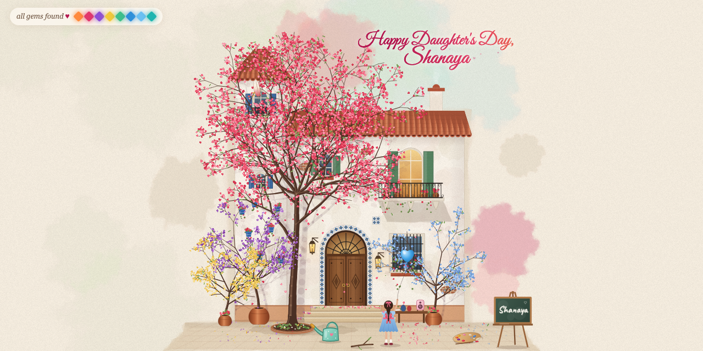

# Casa de Gemas 🏡✨

*A little garden of hidden gems.*

Casa de Gemas is a tiny interactive watercolor world made as a Happy Daughter's Day gift: a whitewashed Spanish house, a bare courtyard, a watering can, and a year of hidden gems. Oli the owl lives on the tower roof and narrates as the garden moves through spring, summer, autumn and winter. Find every gem and, on the last snowy day, a message rises from the chimney — with *her* name in it.

**Play it:** https://deepujain.github.io/casadegema/ · the original spring-only gift: https://1xaispark.com/games/casa-de-gemas



It is one self-contained `index.html` — hand-drawn Canvas 2D art, spring physics for every branch and petal, and music generated live with the Web Audio API. No images, no libraries, no build step.

---

## How to play

The garden starts bare. Pick up the watering can and water the tree bed — a bougainvillea grows. Then explore. Each season has its own gems; each one pops up where you found it and flies to the counter in the top-left. Find them all and Oli says goodbye to the season, and the next season arrives on its own element — a rising sun for summer, a gust of wind full of leaves for autumn, a snowfall for winter — changing the trees and flowers as it passes over them. A full year takes about 10–15 minutes.

Every season has five gems. One of them is always a little visitor hiding in one of the blue flower pots on the tower wall — a different pot each season. Tapping a pot does nothing but puff a few petals; each season's visitor only comes out for that season's action.

### 🌸 Spring (5 gems)

| Gem | How to find it |
| --- | --- |
| 🔊 Music | Tap the little pink speaker on the table. |
| 🌸 Shake | Grab a branch and shake it — every petal falls on its own. |
| 🌱 Pots | Water every pot so all the plants grow. |
| 🦋 Butterfly | Tap the paint palette on the ground and pick a new petal color. Your butterfly cursor changes color too. |
| 🐣 Nest | Water the pots on the tower wall with the can. Each watered pot bursts into a fuller bloom that stays, and one of them hides a nest of chicks. The nest stays in its pot all year; the chicks chirp now and then in spring, and any time your butterfly comes close (with music on). They grow a little each season, and on the first winter morning (turn a lantern back on) they fly off one by one, somewhere warm. |

Tapping a lantern any time of year sends its fireflies off to the tree (or the balcony railing).

### ☀️ Summer (5 gems)

Her little sister walks out of the front door and holds her hand for the rest of the year, dressed for each season.

| Gem | How to find it |
| --- | --- |
| 🪁 Kite | A kite is tangled in the tree, its string running down to her hand. Shake the branches and it wriggles loose, lifts out of the canopy and flies from her hand. |
| 🌻 Sunflower | Water the seed next to the little pot by the tower (pouring on that pot counts too). |
| 🦋 Friends | Tap the blue jar on the bench. Three butterflies follow you around. |
| 🎈 Balloon | Pick up the twig lying on the ground and pop the girl's balloon with it. |
| 🐞 Ladybug | Water the thirsty wall pots, or rest your butterfly on one (hold still for a moment; on a phone, tap and wait), until a ladybug comes to say hello. |

### 🍂 Autumn (5 gems)

| Gem | How to find it |
| --- | --- |
| 🍁 Leaves | Pick up the rake and sweep over the fallen leaves any way you like (it scrapes and crunches). Every leaf you touch skitters onto the little heap at her feet, which grows as you go. When the courtyard is clear she jumps in. |
| ☂️ Umbrella | Tap the grey cloud to make it rain, then tap the umbrella by the wall. She tilts it over her little sister so it keeps them both dry. |
| 🎃 Pumpkin | Water the little patch of soil in front of the pot. |
| 🦉 Night | Turn both lanterns off: sunset, then night — Oli hoots and flies a loop around the tree. |
| 🐭 Mouse | A little tail pokes out of one wall pot and it rustles now and then. Tap that pot (or press and wiggle it) and a field mouse with an acorn peeks out. |

### ❄️ Winter (5 gems)

Winter opens on a long night: the lanterns are out and their fireflies rest in the bare tree. Relight the lanterns whenever you like.

| Gem | How to find it |
| --- | --- |
| ⛄ Snowman | Tap the three snowy mounds to roll snowballs; once he is stacked his carrot nose pops on by itself. |
| 🔥 Hearth | Tap the cold chimney. Smoke rises and the windows glow. |
| ✨ Lights | Tap the balcony railing to string up fairy lights. |
| 🖍️ Name | Pick up the chalk from the easel's ledge, tap the board, and write her name (with `?name=` it's already there; sign it once more). |
| 🐦 Robin | Pick up the twig and tap or brush the snowy wall pots with it (any part of the twig works). Each pot sheds a little snow; one of them has a robin. |

Find the last winter gem and "Happy Birthday, *name*" comes out of the chimney letter by letter, each one floating up to its place, with hearts, while a stream of colorful balloons squeezes out of the chimney and floats away into the night sky; then it gently fades.

**Stuck?** Tap Oli for a hint. A feather also roams the garden: when the little alarm clock at the corner of the house runs down (a random 18–48 seconds), it rings and the feather flies to your next gem. Tap the clock to ring it early.

**Really stuck?** Every half a minute or so a perky-eared puppy peeks out from behind the casa: over the chimney, over the roof, around the tower, or around the far corner by the clock. He says woof woof as he pops up, ears wiggling. Tap him before he ducks back and he sniffs out every gem still hidden this season, one by one (freeing the kite, opening the jar, building the snowman and so on).

**Keys:** `Esc` puts down whatever you're holding · `M` toggles music · `R` starts the year over from spring.

**Phones:** the garden opens zoomed in to a finger-friendly size, in portrait or landscape. Drag to look around and pinch to zoom; Oli's hints and the finale glide the view to where you need to look. Taps snap to the nearest thing you can interact with. The butterfly sits just above your fingertip, and anything you carry rides above it too: the watering can pours right above your finger, and the twig, rake and chalk stay in sight. Carry a tool to the edge of the screen and the view follows. To put a tool back, tap its spot. The gems and how you find them are the same as on a laptop.

### Personalize it

Add a name to the link and it's already written on the easel and in the final message:

```
https://deepujain.github.io/casadegema/?name=Shanaya&from=Dad
```

With a name, the game opens on a little birthday card for her (signed by `from`, if you add it). Without a name, the card offers to make that link for someone and share or copy it. "Just play the garden" skips it.

Add `&season=summer`, `autumn` or `winter` to start later in the year (everything before it is already done).

## Run it locally

It's a single file. Open `index.html` in any modern browser, or serve the folder:

```bash
python3 -m http.server 8000
# then open http://localhost:8000
```

To host it, drop `index.html` anywhere that serves static files (GitHub Pages, Netlify, S3, a Next.js `public/` folder, …).

## How it's built

- **Rendering:** Canvas 2D on a fixed 1200×950 logical stage scaled to the window. The house, sky and ground are pre-rendered once into offscreen layers using a watercolor "wash" technique (layered, low-alpha, randomly deformed polygons + paper grain). Small screens crop the empty margins.
- **Tree:** procedurally grown segments with spring physics; grabbing a branch bends its whole parent chain. Petals are attached along segments and detach when shaken hard, then flutter down and settle on the ground.
- **Day cycle:** multiply-tinted overlays that ease between day, dusk, night and dawn based on how many lanterns are off.
- **Seasons:** a `CHAPTERS` array (spring, summer, autumn, winter) holds each season's gems, Oli's lines, a color grade and weather. Trees follow the year: mostly blossoms with a few fresh leaves in spring, full green leaves in summer, turning leaves in autumn, and bare branches in winter where snow slowly builds up as it falls. Winter adds snow on the roofs and courtyard, and autumn a rain cloud.
- **Oli:** a speech bubble narrates each season, reacts to discoveries, and gives a hint when tapped.
- **Music:** fully generative Web Audio — an Andalusian cadence (Am–G–F–E) with pads, plucks, chimes and a convolution reverb, plus petal-flutter, pouring water and rain, pops, owl hoots and lantern chimes. Silent until you tap the speaker.
- **Gems:** the current season's gem list drives the counter, the fly-to-counter effect, Oli's hints and the feather.

## Made with Claude

Casa de Gemas was built entirely through conversation with **Claude Opus 5.5** in Cursor — no code written by hand. It was inspired by a post from [@thebuggeddev](https://x.com/thebuggeddev) showing Claude building "a little artistic world in pure JavaScript where a tree grows over time, you can grab and shake its branches, and the leaves fall naturally."

Want to build your own? The full prompt is in [`SKILL.md`](SKILL.md#the-full-prompt).

## License

[MIT](LICENSE) — make one for someone you love.
