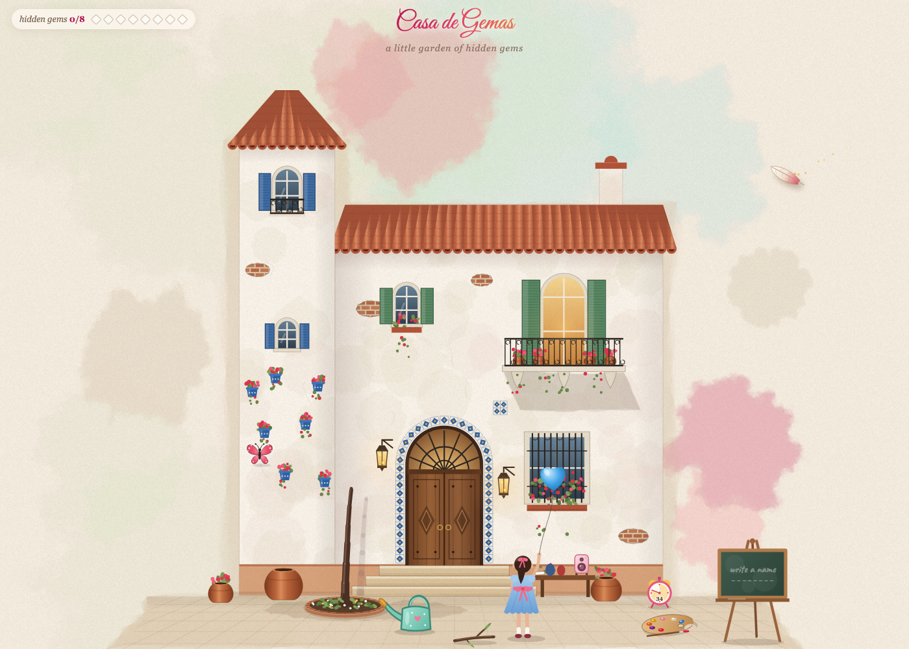

# Casa de Gemas 🏡✨

*A little garden of hidden gems.*

Casa de Gemas is a tiny interactive watercolor world made as a Happy Daughter's Day gift: a whitewashed Spanish house, a bare courtyard, a watering can, and 8 hidden gems waiting to be discovered. Find them all and a message rises from the chimney — with *her* name in it.

**Play it:** https://1xaispark.com/games/casa-de-gemas · mirror on GitHub Pages: https://deepujain.github.io/casadegema/



It is one self-contained `index.html` — hand-drawn Canvas 2D art, spring physics for every branch and petal, and music generated live with the Web Audio API. No images, no libraries, no build step.

---

## How to play

The garden starts bare. Pick up the watering can and water the tree bed — a bougainvillea grows. Then explore. There are **8 gems**; each one pops up where you found it and flies to the counter in the top-left.

| Gem | How to find it |
| --- | --- |
| 🔊 Music | Tap the little pink speaker on the table. |
| 🌸 Shake | Grab a branch and shake it — every petal falls on its own. |
| 🌱 Pots | Water every pot so all the plants grow. |
| 🦋 Butterfly | Tap the paint palette on the ground and pick a new petal color. Your butterfly cursor changes color too. |
| 🏮 Lantern | Tap a lantern by the door. It goes out and its fireflies drift off to the tree (or the balcony railing). |
| 🦉 Night | Turn both lanterns off: sunset, then night — and an owl flies in. Relight them for early morning; the owl leaves slowly. |
| 🎈 Balloon | Pick up the twig lying on the ground and pop the girl's balloon with it. |
| 🖍️ Name | Pick up the chalk from the table, tap the easel, and write a name. |

Find all 8 and "Happy Daughter's Day, *name*" rises from the chimney with hearts, then gently fades.

**Stuck?** A feather roams the garden. When the little alarm clock at the corner of the house runs down (a random 18–48 seconds), it rings and the feather flies to your next gem. Tap the clock to ring it early.

**Keys:** `Esc` puts down whatever you're holding · `M` toggles music · `R` replants the garden.

**Phones:** touch works — taps snap to the nearest thing you can interact with. Landscape gives the biggest garden.

### Personalize it

Add a name to the link and it's already written on the easel and in the final message:

```
https://1xaispark.com/games/casa-de-gemas?name=Shanaya
```

## Run it locally

It's a single file. Open `index.html` in any modern browser, or serve the folder:

```bash
python3 -m http.server 8000
# then open http://localhost:8000
```

To host it, drop `index.html` anywhere that serves static files (GitHub Pages, Netlify, S3, a Next.js `public/` folder, …).

## How it's built

- **Rendering:** Canvas 2D on a fixed 1200×950 logical stage scaled to the window. The house, sky and ground are pre-rendered once into offscreen layers using a watercolor "wash" technique (layered, low-alpha, randomly deformed polygons + paper grain). Small screens crop the empty margins.
- **Tree:** procedurally grown segments with spring physics; grabbing a branch bends its whole parent chain. Petals are attached along segments and detach when shaken hard, then flutter down and settle on the ground.
- **Day cycle:** multiply-tinted overlays that ease between day, dusk, night and dawn based on how many lanterns are off.
- **Music:** fully generative Web Audio — an Andalusian cadence (Am–G–F–E) with pads, plucks, chimes and a convolution reverb, plus petal-flutter, pouring water, pops, owl hoots and lantern chimes. Silent until you tap the speaker.
- **Gems:** a single `SURPRISES` array drives the counter, the fly-to-counter effect and the feather's hints.

See [`SKILL.md`](SKILL.md) for an architecture guide aimed at people (and coding agents) who want to change or extend it.

## Made with Claude

Casa de Gemas was built entirely through conversation with **Claude Opus 5.5** in Cursor — no code written by hand. It was inspired by a post from [@thebuggeddev](https://x.com/thebuggeddev) showing Claude building "a little artistic world in pure JavaScript where a tree grows over time, you can grab and shake its branches, and the leaves fall naturally."

Below is every prompt, in order, exactly as typed (typos included — that's how real iteration looks). Two small edits: a local file path was removed, and a pasted assistant reply was trimmed out of one message.

### 1. The first world

> *(screenshot of @thebuggeddev's post)* can you really do this. ? i have claude model selected

> too violet when i move mouse
> i want a spanish house in the background. beaifl

> change colors of the petals
>
> other pots when i click should start growing different color petals
>
> add a seren music behind

> can such a big tree grow in the pot. main plant make it like a tree not in a pot. aestithic
>
> Like the music

> happy daughter day above the chimney after all the plants grow.

> you gorgot to add girl holding a ballon facing home

> all petal colors should be different
> hide petal selector, it shows up when i click palette lying the grojund.

> mouse pointer can you make it different like a something interesting rather than a dot circle.

### 2. Shipping it

> how big is this file ? can i host it in spark ? fun side project

> do it and deploy

### 3. Turning it into a game

> when i shake the tree. i need a like a new shake music that flutters of all petals
> when i tap the laps near door, the lap should go off and the Firefly that make the light fly away

> for every interaction. i am calling it surprise. after show a feather that will fly to that interaction like a hint
>
> remove the pot near door

> when both lanterns glow is off . the sceen should become twilight or night. currently its day and owl should fly into the scene
>
> i like the counter. of every suprise discovered.

> the feathere should not come immediately and keep hiting.let users discover. until then feathere keeps flying aroind. keep the feather little small in size
>
> after i click shake the entire shake is goes into loop.

> at scene load. have a cute water can. that i will take and pour that will start the tree to grow. same for other plants. once it starts growing.

> happy daughters day message pops up only after all surprises are discovered from chimney

> owl should fly away slowly. only after both laterns are on. 1 latern off. twilight (sun setting), another off night. when i turn on like early morning sinlight and second day

> when i lift the can. show butterly at handle. otherwise its confuing

> fireflies when they go out of latern. if there is a tree, they hangout there. otherwise near the window railing

> what are all the surprises. am confused.
>
> lets call surprises as gems, hiding. that needs to be discovered

> dont say good morning. dont show sun.

> Open the paint palette: click the wooden palette on the ground to change petal colors. instead. butterfly changing colors is a good gem
>
> once you discover a gem, the gem should move towards top left to increase scrore

> turn on music must be another gem. remove the music:on/off and simply click must not turn on music. there can be a small cute speaker on the table. next to pot, there is one already

> interacting with baloon is , is simply moving mouse today. it can be accidental. make something better. but i want gem with baloon. may be if you pop the baloon with a branch lying around

> continue

> do not say day 2. dont give any message.
>
> lets give this game a name
>
> after a while Happy Daughters day message goes away

> deploy

### 4. Making it personal

> Add a eisel where i can write a name. so that Happy Daughters DAy, Shanaya can show up. and it becomes custamization. May be this is another gem. have a eisel lying around and a chalk on the table

### 5. Polish

> after i shake branch. and click the music goes in a loop for a while. main music is good. the . branch shake that causes the petal move sound that one. this needs a fix
>
> baloon shows up again after all the gems are discovefred and is of same color as butterly

> after baloon pops and after pallet color is picked changes. stick should go back to its place by itself and color selection should disappear

> after baloon pops the hand should go back in resting position

> after baloon pops the stick should go back slowly

> add a clock at bottom right of house. that will show time until next hint. cute clock.
> show name of the game after page loads
> instea of pick the waterning can and ....

> after page loads, the feathere should simply be roaing aroumnd and not imemdiately point to 1st hint
>
> page works great on laptop or desktop with mouse. but is super bad when rendered on mobile app and its finger touch screen instead of mouse to interacti with .
>
> I do not see clock
> casa de gems is cut off. smaller its font.
> the butter fly rests on the firsl back on the dress bow as a bow

> move clock to bottom right of the house on ground not on the wall

> clock little more to right ,

> when page loads. the buttlef is on the back of blow . make it same size as flying around and keep it fluttering
>
> clock face needs changes. i cant see numbers clearly and there is wiered horizotal curve line

> reduce the number size. and have a dial one dial move until timer
> the count down on clock face must be random for next hint.

### 6. Launch

> deploy

> URL should be https://1xaispark.com/games/casa-de-gemas

Plus a handful of "write a tweet" / "now one for linkedin" requests along the way.

### The whole thing as one prompt

If you want to recreate it in a single shot, this prompt captures the final design, including lessons learned along the way:

```text
Build a single self-contained index.html (pure JavaScript + Canvas 2D, no libraries, no
images, no build step) called "Casa de Gemas" — a little garden of hidden gems, made as a
Happy Daughter's Day gift.

SCENE
- Soft watercolor illustration on warm cream paper. Fixed 1200×950 logical stage scaled to
  fit the window (letterboxed; on small screens crop the empty margins). Pre-render static
  art into offscreen layers using layered low-alpha deformed polygons plus paper grain.
- A whitewashed Spanish house: a tower with a terracotta roof, blue shutters and wall pots,
  a main house with a tiled roof, a chimney, an arched wooden door with blue-tile surround
  and steps, a balcony with iron railing, a barred window with flowers, exposed brick
  patches, two lanterns beside the door.
- In the courtyard: a round brick tree bed (no pot for the main tree), three small pots, a
  wooden bench/table with two jars, a little pink speaker and a stick of chalk, a wooden
  paint palette on the ground, a twig lying on the ground, a chalkboard easel on the right,
  a cute watering can, and a little girl seen from behind holding a heart balloon on a
  string, with a bow on the back of her dress.
- Custom cursor: a butterfly in the current petal color, with sparkles. It perches (slow
  wings) on whatever tool you hold. When the pointer is away it flies to the girl's dress
  and rests there as her bow, full size, still fluttering.

GROWTH
- The garden starts bare. Pick up the watering can (click), click-and-hold to pour — water
  drops, splashes and a pouring sound. Watering the bed grows a bougainvillea tree
  (procedural segments with stable spring physics; grabbing a branch bends its parent
  chain). Watering each pot grows a small plant. Every tree uses a different petal color.
  Put the can back by clicking its spot or pressing Esc; it also returns by itself when
  everything is planted.
- Petals: shaking a branch hard detaches petals that flutter down with wind and settle on
  the ground, then slowly fade; bare spots regrow.

GEMS (8) — a counter at the top-left ("hidden gems n/8" with 8 gem icons). Each discovery
pops a gem at that spot which then flies to the counter and lights it up.
1. Music: tap the speaker on the table. Nothing else starts music.
2. Shake: shake a branch.
3. Pots: grow every plant.
4. Butterfly: tap the palette, pick a new petal color (panel closes itself after picking).
5. Lantern: tap a lantern — it goes out and its fireflies fly off to hang in the tree
   canopy (or the balcony railing if there's no tree); relighting calls them back.
6. Night: one lantern off = sunset tint, both off = night with stars, moon and a warm
   balcony glow; an owl flies in and perches on the tower roof and hoots. Relighting one =
   early-morning tint, both = day. The owl leaves slowly only when both are on. No sun,
   no "good morning" or "day 2" text.
7. Balloon: pick up the twig and pop the balloon with its tip (a mouse hover never pops
   it). "pop!" + shards; the twig floats back home slowly; the girl's arm lowers to rest;
   the balloon does not return. Balloon is sky blue so it never matches the butterfly.
8. Name: pick up the chalk, tap the easel, type a name (DOM input over the board), Enter.
   The name is written on the board in chalk. ?name= in the URL pre-fills it.

HINTS
- A small feather roams the garden on a gentle path. It never hints right away. After a
  random 18–48 s without a discovery (and a few seconds idle), it flies to the next gem's
  location for 10 s (or to the tool that gem needs first).
- A cute pink alarm clock stands on the ground at the bottom-right of the house: a gold
  wedge and a single hand sweep down to zero, with a small seconds number; it rings and
  wobbles when the hint arrives. Tapping it rings the hint early.

ENDING
- After all 8 gems: "Happy Daughter's Day," and the name on a second line rise from the
  chimney in a script font with a pink-to-orange gradient, smoke puffs and floating
  hearts; it fades after ~18 s.

TITLE
- On load, "Casa de Gemas" in a script font with "a little garden of hidden gems" under
  it fades in at the top (with padding so the swashes aren't clipped); it fades on the
  first click.

SOUND (Web Audio, all generated, silent until the speaker is tapped)
- Gentle Andalusian cadence Am–G–F–E: soft pads, plucked notes, chimes, convolution
  reverb. Petal-flutter notes only while your hand is shaking a branch (short notes that
  fade within ~0.6 s of letting go — never loop), water pour, pop, owl hoots, lantern
  chimes. Unlock audio on touchend for iOS.

TOUCH
- Works with fingers: taps snap to the nearest interactive thing within fingertip reach,
  bigger branch/balloon hit areas, no double-tap zoom, no text selection, no stuck hover
  glows; in portrait show "turn your phone sideways for a bigger garden".

KEYS: Esc drops the held tool, M toggles music, R replants.
```

## License

[MIT](LICENSE) — make one for someone you love.
